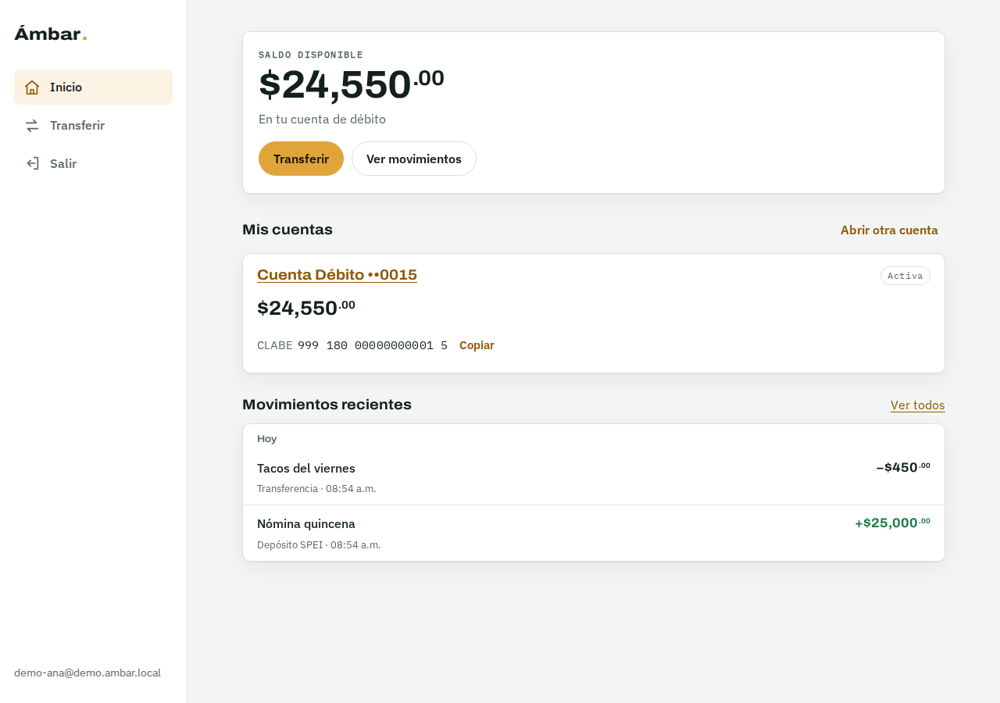
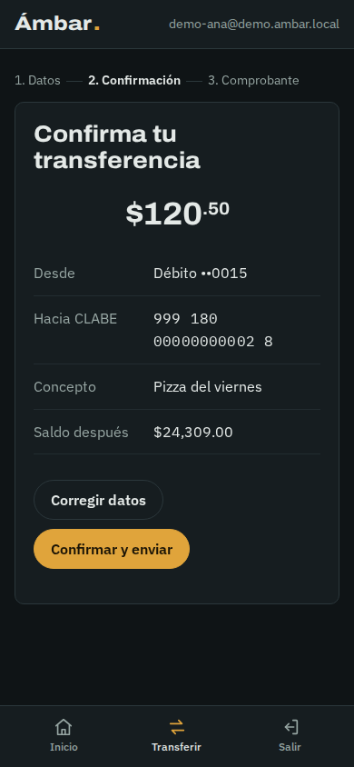
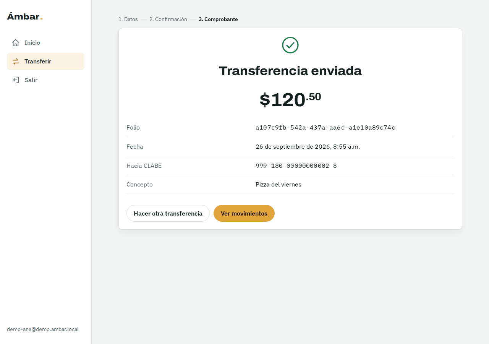

# Ámbar.core

[](https://github.com/DraK028/ambar-core/actions/workflows/ci.yml)
[](LICENSE)

Core bancario omnicanal de portafolio. Este repositorio contiene la **fase 1** (contrato de la API, servicio **Ledger** con doble partida, pruebas, infraestructura base y CI) la **fase 2a** (Cognito, ECS Fargate, API Gateway con VPC Link y despliegue continuo) la **fase 2b** (banca web en Next.js con patrón BFF, pruebas E2E y publicación con CloudFront), la **fase 3** (app móvil con login biométrico por llave de hardware y confirmación de transferencias) la **fase 4** (eventos con outbox → EventBridge, automatización con n8n, avisos, detección de fraude con confirmación desde la app y conciliación diaria) y la **fase 5** (asistente financiero con IA en Bedrock, de solo lectura y con minimización de datos).

> Proyecto educativo. No procesa dinero real; la CLABE usa un código de banco ficticio (`999`).

## Qué hay en el repositorio

| Pieza | Ubicación | Resumen |
|---|---|---|
| Contrato OpenAPI 3.1 | `packages/api-contract/openapi.yaml` | Fuente de verdad. Spectral con reglas propias (montos enteros, `Idempotency-Key` obligatoria). |
| Servicio Ledger | `services/ledger` | NestJS 11 + PostgreSQL. Cuentas, movimientos, transferencias, reversos y depósitos de QA. |
| Esquema SQL | `services/ledger/db/migrations` | Invariantes en la base: asientos que cuadran, tablas de solo inserción, saldo no negativo. |
| Pruebas | `services/ledger/src/**/*.spec.ts`, `services/ledger/test` | 147 pruebas: unitarias, integración con Postgres real (incluidos los usuarios de mínimo privilegio) y e2e HTTP validadas contra el contrato. |
| Infraestructura | `infra/terraform` | VPC en 3 AZ, Aurora Serverless v2, Cognito, ECS Fargate, NLB interno, API Gateway con VPC Link, WAF opcional, roles OIDC, alerta de presupuesto. |
| CI | `.github/workflows/ci.yml` | Lint del contrato, pruebas con Testcontainers, imagen Docker con Trivy, `terraform validate`. |
| Despliegue | `.github/workflows/deploy-dev.yml` | En cada push a main: pruebas, imagen a ECR, migraciones como tarea única, actualización del servicio y prueba de humo. |
| Login de desarrollo | `tools/cognito-login.mjs` | Obtiene tokens de Cognito con PKCE (usuario) o client credentials (QA). |
| Banca Web | `apps/web` | Next.js 16 con patrón BFF: sesiones en servidor, OIDC con PKCE, CSP con nonce, transferencias en 3 pasos. |
| Cliente de la API | `packages/api-client` | Tipos generados desde `openapi.yaml`; el CI falla si no están al día con el contrato. |
| Reglas compartidas | `packages/banking-rules` | Montos en centavos y CLABE, usados por web y móvil con las mismas pruebas. |
| App móvil | `apps/mobile` | Expo SDK 57 + módulo nativo propio (Kotlin/Swift) de llave en Keystore / Secure Enclave. |
| Tokens de desarrollo | `tools/dev-auth-server.mjs` | Sustituye a Cognito para correr la app y n8n contra el Ledger local. Solo escucha en 127.0.0.1. |
| Contrato de eventos | `packages/events` | Sobre, firma HMAC de webhooks y rutas hacia n8n. `asyncapi.yaml` documenta cada evento. |
| Relay del outbox | `services/ledger/src/relay` | Publica `ledger.outbox` en EventBridge con `SKIP LOCKED`, `LISTEN/NOTIFY` y reintentos con backoff. |
| Forwarder | `services/event-forwarder` | Lambda: SQS (una cola por flujo) → webhooks de n8n firmados. |
| Automatización | `automation/n8n` | Seis flujos de n8n versionados, imagen propia, prueba E2E y revisión estática en CI. |
| Asistente | `services/assistant` | Bedrock (Converse + Guardrails) con herramientas de solo lectura, redacción de datos, revisión de la salida, auditoría sin contenido y evaluaciones. |

## Arranque local

Requisitos: Node 22+, Docker.

```bash
npm install
npm run db:up                                   # Postgres 16 en localhost:5432
cp services/ledger/.env.example services/ledger/.env
cd services/ledger
set -a && source .env && set +a
npm run migrate
npm run seed                                     # Ana y Luis con saldo, e imprime un token de Ana
npm run dev                                      # http://localhost:3000
```

Probar la API con el token que imprimió `seed` (o `npm run token -- demo-ana`):

```bash
TOKEN=$(npm run -s token -- demo-ana)

curl -s localhost:3000/v1/accounts -H "Authorization: Bearer $TOKEN"

curl -s localhost:3000/v1/transfers \
  -H "Authorization: Bearer $TOKEN" \
  -H "Idempotency-Key: $(uuidgen)" \
  -H "Content-Type: application/json" \
  -d '{"source_account_id":"<id de Ana>","destination_clabe":"<CLABE de Luis>","amount":12050,"concept":"Pizza"}'
```

Montos siempre en centavos: `12050` son $120.50.

Mock server de QA generado desde el contrato, sin backend: `npm run mock -w @ambar/api-contract` (puerto 4010).

## Pruebas

```bash
cd services/ledger
npm run test:unit          # dominio, sin base de datos
npm run test:integration   # levanta postgres:16-alpine con Testcontainers (requiere Docker)
npm run test:cov           # todo, con umbrales de cobertura (dominio ≥ 90 %)
```

Sin Docker, apunta a cualquier Postgres vacío: `DATABASE_URL_TEST=postgres://… npm run test:integration`.

Lo que cubren las pruebas de integración y e2e:

- **Cuadre**: cada transferencia genera dos postings que suman cero; un asiento descuadrado insertado a mano se rechaza en el `COMMIT`.
- **Inmutabilidad**: `UPDATE` y `DELETE` sobre asientos y postings fallan; las correcciones son reversos.
- **Concurrencia**: 50 transferencias simultáneas contra un saldo que alcanza para 10 → exactamente 10 pasan, saldo final 0, nunca negativo. Transferencias cruzadas A→B / B→A sin deadlocks.
- **Idempotencia**: 10 reintentos simultáneos con la misma llave cobran una sola vez; reusar la llave con otro cuerpo da 409.
- **BOLA**: la cuenta de otro usuario responde 404, tanto al consultarla como al usarla de origen.
- **Reversos**: restauran saldos, solo se permiten una vez, funcionan sobre cuentas congeladas (caso fraude).
- **Conciliación**: el saldo guardado coincide con el derivado de los postings; una alteración directa se detecta.
- **Contrato**: cada respuesta de las pruebas e2e, incluidos los errores, se valida contra `openapi.yaml`.

## Decisiones de diseño

- **Doble partida con signo contable.** `postings.amount` es débito > 0 y crédito < 0. Las cuentas de cliente son pasivos del banco (saldo acreedor); la cuenta `SPEI_SETTLEMENT` es un activo. Ver el encabezado de `001_ledger_schema.sql`.
- **Una transacción por operación.** Se reserva la `Idempotency-Key`, se bloquean las cuentas con `SELECT … FOR UPDATE` ordenado por id, se validan saldo y estado, se insertan postings, se actualizan saldos y se escribe el evento en `ledger.outbox`. Todo o nada (`src/application/ledger.service.ts`).
- **Doble red de seguridad.** El dominio valida en TypeScript con errores claros y Postgres vuelve a validar con triggers diferidos y `CHECK`. Un bug en el código no puede descuadrar el ledger.
- **Outbox transaccional.** El evento (`transfer.posted`, `account.opened`, …) se guarda en la misma transacción que el movimiento, y el relay lo publica después (fase 4). Nunca hay un movimiento sin evento ni un evento sin movimiento.
- **Autenticación igual en local y en AWS.** En local los tokens son HS256 con los mismos claims que Cognito (`sub`, `scope`, `client_id`, `token_use`). En AWS se cambia `AUTH_MODE=cognito` y se validan contra el JWKS del user pool. La configuración impide `AUTH_MODE=local` y los endpoints de QA en producción.
- **Errores RFC 9457** con un `code` estable que QA puede asertar.

## API

| Método | Ruta | Scope |
|---|---|---|
| GET | `/health` | público |
| GET, POST | `/v1/accounts` | `accounts.read`, `accounts.write` |
| GET | `/v1/accounts/{id}` | `accounts.read` |
| GET | `/v1/accounts/{id}/movements` | `accounts.read` |
| POST | `/v1/transfers` | `transfers.write` + `Idempotency-Key` |
| GET | `/v1/entries/{id}` | `ledger.admin` |
| POST | `/v1/entries/{id}/reversals` | `ledger.admin` + `Idempotency-Key` |
| POST | `/v1/qa/deposits` | `qa.write` + `Idempotency-Key` (solo fuera de prod) |
| GET, POST | `/v1/devices` | `devices.write` (app móvil) |
| DELETE | `/v1/devices/{id}` | `devices.write` |
| POST | `/v1/step-up/challenges` | `transfers.write` |
| PUT | `/v1/devices/{id}/push-token` | `devices.write` |
| GET | `/v1/notifications` | `accounts.read` |
| POST | `/v1/notifications/{id}/read` | `accounts.write` |
| GET | `/v1/fraud-cases/{id}` | `accounts.read` |
| POST | `/v1/fraud-cases/{id}/answer` | `transfers.write` |
| POST | `/v1/admin/accounts/{id}/unfreeze` | `ledger.admin` + grupo `operators` |
| POST | `/v1/internal/notifications`, `/v1/internal/fraud-cases` | `internal.*`, solo cliente de n8n y solo dentro de la VPC |
| GET | `/v1/internal/reconciliation` | `internal.reconcile` |
| POST | `/v1/assistant/messages` | `assistant.chat` + `accounts.read` (servicio del asistente) |
| GET, DELETE | `/v1/assistant/conversations/{id}` | `assistant.chat` |

## Fase 2a · El core en AWS

```
Cliente ──HTTPS──▶ API Gateway (REST, stage dev)
                    │  WAF opcional · autorizador Cognito · límites por stage
                    ▼  VPC Link (PrivateLink)
                   NLB interno ──▶ ECS Fargate · Ledger (subredes privadas)
                                     │  token IAM de 15 min como ambar_app, TLS verificado
                                     ▼
                                   Aurora PostgreSQL (subredes aisladas)
```

Decisiones de esta fase:

- **Doble validación del token.** API Gateway rechaza tokens inválidos o sin scopes de `ambar-api` antes de llegar a la VPC. El Ledger vuelve a validar firma, emisor, cliente, scope exacto por ruta y grupo. Si alguien alcanzara el NLB sin pasar por el gateway, no entra.
- **`ledger.admin` exige el grupo `operators`.** En Cognito los scopes pertenecen al app client, no al usuario: cualquiera que entre por el cliente de operación recibiría ese scope. El grupo es lo que identifica al operador.
- **Sin contraseña de base de datos en el servicio.** El Ledger se conecta como `ambar_app` con un token IAM que dura 15 minutos (`rds-db:connect` en el rol de la tarea). Solo la tarea de migraciones usa el secreto maestro de Aurora, gestionado por RDS en Secrets Manager.
- **Mínimo privilegio probado.** `ambar_app` hereda `app_ledger`, que no puede modificar ni borrar asientos. Una prueba de integración corre las operaciones reales con ese usuario.
- **Errores del gateway en RFC 9457.** Un 401 del autorizador de API Gateway tiene el mismo formato `problem+json` que un 401 del Ledger.
- **Migraciones antes del código nuevo.** El workflow corre la tarea de migraciones y solo si termina con código 0 actualiza el servicio. ECS revierte solo si la nueva versión no pasa los health checks.

### Desplegar dev

```bash
cd infra/terraform/envs/dev
cp terraform.tfvars.example terraform.tfvars      # owner, repo de GitHub, correo del presupuesto
terraform init -backend-config="bucket=<bucket-de-estado>"
terraform apply                                   # ~20 min la primera vez (Aurora y VPC Link tardan)
terraform output github_variables                 # cópialas a las variables del repositorio
terraform output deploy_role_arn                  # secreto AWS_DEPLOY_ROLE_ARN
terraform output api_url                          # variable API_URL
```

Después, ejecuta el workflow **Deploy dev** desde la pestaña Actions (o haz push a main). Hasta ese primer despliegue el servicio de ECS muestra tareas fallidas porque la imagen `bootstrap` no existe; es esperado.

Si tu cuenta ya tiene configurado el rol de CloudWatch de API Gateway, usa `manage_apigw_account_role = false`.

### Probar la API desplegada

```bash
# Datos del entorno desde Terraform
COGNITO=$(terraform -chdir=infra/terraform/envs/dev output -json cognito)
DOMAIN=$(echo "$COGNITO" | jq -r .hosted_domain)
API=$(terraform -chdir=infra/terraform/envs/dev output -raw api_url)

# Abre el navegador; regístrate o inicia sesión en la página de Cognito
TOKEN=$(npm run -s login:dev -- --domain "$DOMAIN" --client-id "$(echo "$COGNITO" | jq -r .client_ids.cli)")

curl -s "$API/health"
curl -s -X POST "$API/v1/accounts" -H "Authorization: Bearer $TOKEN"
```

Para operar el ledger, agrega tu usuario al grupo y entra con el cliente `ops`:

```bash
POOL=$(echo "$COGNITO" | jq -r .user_pool_id)
aws cognito-idp admin-add-user-to-group --user-pool-id "$POOL" --username <tu-correo> --group-name operators
OPS_TOKEN=$(npm run -s login:dev -- --domain "$DOMAIN" --client-id "$(echo "$COGNITO" | jq -r .client_ids.ops)" \
  --scopes "openid ambar-api/ledger.admin ambar-api/accounts.read")
```

Depósitos de prueba con el cliente de QA (máquina a máquina):

```bash
QA_CLIENT=$(echo "$COGNITO" | jq -r .client_ids.qa)
export QA_CLIENT_SECRET=$(aws cognito-idp describe-user-pool-client --user-pool-id "$POOL" \
  --client-id "$QA_CLIENT" --query UserPoolClient.ClientSecret --output text)
QA_TOKEN=$(npm run -s login:dev -- --domain "$DOMAIN" --client-id "$QA_CLIENT" --m2m)
```

### Costos de dev (us-east-1, encendido todo el mes)

| Recurso | Aproximado |
|---|---|
| NAT Gateway | USD 33 |
| NLB interno | USD 17 |
| Fargate Spot (0.25 vCPU, 0.5 GB) | USD 3 |
| Aurora Serverless v2 con pausa a 0 ACU | USD 1–10 según uso |
| API Gateway, Cognito, ECR, CloudWatch | menos de USD 3 con tráfico de demo |
| WAF (si `enable_waf = true`) | USD 9 |

Unos USD 55–65 al mes si se deja encendido. Para un portafolio conviene `terraform destroy` al terminar de trabajar y volver a crear el entorno para las demos; el presupuesto avisa al 80 %.

### Pendiente conocido

- **TLS entre API Gateway y el NLB** sin dominio propio: el tramo viaja por PrivateLink dentro de AWS. Con dominio propio (fase 2b) ya va cifrado.
- **Rotación de refresh tokens y protección contra amenazas de Cognito** (plan Plus) no están activadas por costo.

## Fase 2b · Banca Web

| Inicio (escritorio) | Confirmación (móvil, tema oscuro) | Comprobante |
|---|---|---|
|  |  |  |

```
Navegador ──HTTPS──▶ CloudFront ──(encabezado secreto)──▶ ALB ──▶ ECS · Next.js (BFF)
   cookie de sesión opaca                                            │  sesión en DynamoDB, tokens cifrados
   (HttpOnly, SameSite=Strict)                                       ▼
                                                             API Gateway ──▶ Ledger
```

Decisiones de esta fase:

- **Los tokens nunca llegan al navegador.** El BFF hace el login con Cognito (Authorization Code + PKCE + nonce, cliente confidencial) y guarda los tokens en DynamoDB cifrados con AES-256-GCM. El navegador solo recibe un identificador de sesión aleatorio en una cookie `__Host-`, `HttpOnly`, `Secure` y `SameSite=Strict`.
- **Sesión con dos relojes.** Vence a los 15 minutos sin actividad y a las 12 horas en cualquier caso. La interfaz avisa 60 segundos antes y permite seguir conectado (WCAG 2.2.1), calculando el tiempo con el reloj del servidor para no depender de la hora del dispositivo.
- **Cerrar sesión de verdad.** El logout borra la sesión en el servidor, revoca el refresh token en Cognito y cierra la sesión del dominio de Cognito. Una prueba E2E comprueba que la cookie anterior ya no sirve.
- **Idempotencia en la interfaz.** La `Idempotency-Key` se genera al confirmar el resumen y se reutiliza en cada reintento de ese mismo resumen. Si la red falla después de que el core registró la transferencia, reintentar no cobra dos veces.
- **Defensas del navegador.** CSP con nonce por solicitud y `strict-dynamic`, `frame-ancestors 'none'`, verificación de `Origin` en todos los POST, redirecciones de login solo a rutas internas y `Cache-Control: no-store` en todas las páginas.
- **Contrato compartido.** La web usa un cliente tipado generado desde `openapi.yaml`; si el contrato cambia y la web no, la compilación falla.
- **Accesible por diseño.** axe-core (WCAG 2.2 AA) corre en cada pantalla dentro de las pruebas E2E. Además hay pruebas de flujo completo solo con teclado, resumen de errores con foco y enlaces a cada campo, montos leídos completos por lector de pantalla y una vista móvil sin scroll horizontal.

### Correr la web en local

Con el Ledger corriendo (ver *Arranque local*):

```bash
cd apps/web
APP_URL=http://localhost:3001 LEDGER_API_URL=http://localhost:3000 \
AUTH_PROVIDER=local LOCAL_JWT_SECRET=<el mismo del Ledger> \
SESSION_SECRET=$(openssl rand -hex 24) npm run dev
```

Abre http://localhost:3001 y entra como Ana o Luis (usuarios de `npm run seed`). El modo local no usa Cognito, y la configuración impide activarlo fuera de `APP_ENV=local`.

Para probar contra Cognito real desde tu máquina, usa `AUTH_PROVIDER=cognito` con los datos de `terraform output cognito` y el secreto del cliente web; `http://localhost:3001/api/auth/callback` ya está registrado como callback en dev.

### Pruebas de la web

```bash
npm run test -w @ambar/web        # 58 unitarias: sesión, OIDC, ID token, sellado, montos, CLABE
npm run e2e -w @ambar/web         # 15 E2E con Playwright + axe-core; levanta Ledger y Web solos
```

Las E2E necesitan Postgres en `localhost:5432` (`npm run db:up`) o `E2E_DATABASE_URL`. Cubren el flujo completo de transferencia visto desde ambos clientes, las validaciones, los errores del core mapeados al campo correcto, el uso solo con teclado, el aviso de inactividad (con el reloj de Playwright), el cierre de sesión real, CSRF, BOLA desde la interfaz y la vista móvil.

### Desplegar la web

Se despliega con el mismo `terraform apply` de dev y el workflow **Deploy dev**, que ahora publica también la imagen de la web después del core. Agrega las variables nuevas de `terraform output github_variables` y `WEB_URL` (output `web_url`).

- **Sin dominio propio:** la web queda en `https://<id>.cloudfront.net`. CloudFront habla con el ALB por HTTP dentro de AWS y el ALB rechaza cualquier solicitud que no traiga el encabezado secreto de CloudFront.
- **Con dominio propio** (`domain_name` y `route53_zone_id` en `terraform.tfvars`): un certificado de ACM cubre `ambar.midominio.com`, `api.ambar.midominio.com` y `ledger.internal.ambar.midominio.com`. Con eso hay **TLS en cada tramo**: navegador → CloudFront → ALB, y cliente → API Gateway → NLB del Ledger. Esto cierra el pendiente de la fase 2a.

Costo adicional de la fase 2b en dev: unos USD 20 al mes (ALB ~17, el resto CloudFront, DynamoDB y Secrets Manager con tráfico de demo). Con todo encendido, dev ronda USD 75 al mes.

## Fase 3 · App móvil con llave de hardware

```
Activación (una vez por teléfono)
  App ──crea par P-256 en Keystore / Secure Enclave (biometría obligatoria)──▶ llave privada nunca sale del chip
  App ──POST /v1/devices {llave pública SPKI}──▶ Core (guarda la llave y su huella SHA-256)
  App ──guarda el refresh token con requireAuthentication──▶ Keychain / Keystore

Transferencia que exige confirmación (monto ≥ $5,000 o cuenta nueva)
  App ──POST /v1/transfers──▶ Core: 401 STEP_UP_REQUIRED + WWW-Authenticate (RFC 9470)
  App ──POST /v1/step-up/challenges {operación}──▶ Core: reto de 60 s con el hash de la operación
  App ──biometría──▶ chip firma "ambar-step-up:v1 · reto · nonce · hash"
  App ──POST /v1/transfers + X-Step-Up + misma Idempotency-Key──▶ Core verifica, consume el reto y registra
```

Decisiones de esta fase:

- **La biometría firma, no "responde sí".** Un `if (autenticado)` en JavaScript se evade en un teléfono con root. Aquí la huella o el rostro desbloquean una llave ECDSA P-256 dentro del hardware (StrongBox si existe) y el servidor verifica la firma con la llave pública registrada.
- **La firma vale para una sola operación.** El texto firmado incluye el id y el nonce del reto y el hash de la operación. El reto dura 60 segundos y se consume con `SELECT … FOR UPDATE`. Una firma para $6,000 a una CLABE no sirve para $9,000 ni para otro destino, y no se puede usar dos veces, ni siquiera enviándola en paralelo.
- **Política de step-up en el servidor.** Se exige por monto (≥ $5,000) o por beneficiario nuevo, la defensa típica contra robo de sesión. Aplica a los tokens del cliente `mobile` de Cognito. Un reintento con la misma `Idempotency-Key` después de éxito no vuelve a pedir biometría.
- **Desbloqueo sin contraseña.** El refresh token se guarda con `requireAuthentication`, así que leerlo exige biometría. Si se agrega una huella o un rostro, el sistema invalida la llave y el secreto, y hay que volver a activar el teléfono.
- **Privacidad en pantalla.** `FLAG_SECURE` en Android, una cubierta en el selector de apps y bloqueo tras 2 minutos en segundo plano. `allowBackup=false` evita que el Keystore se restaure en otro teléfono.
- **Máximo 3 dispositivos por usuario**, con candado para que registros en paralelo no rebasen el límite. Revocar un teléfono invalida sus retos pendientes.
- **Certificate pinning opcional** (`react-native-ssl-public-key-pinning`), solo con dominio propio. Se fijan las CA raíz de Amazon, porque ACM cambia la llave del certificado final al renovarlo.

### Correr la app en local

Requiere un build de desarrollo (el módulo nativo no funciona en Expo Go) y el Ledger local corriendo:

```bash
LOCAL_JWT_SECRET=<el del Ledger> node tools/dev-auth-server.mjs      # terminal 1
cd apps/mobile && cp .env.example .env
adb reverse tcp:3000 tcp:3000 && adb reverse tcp:8787 tcp:8787       # emulador de Android
npx expo run:android            # o npx expo run:ios (en el simulador la llave no usa Secure Enclave)
```

Para dev en AWS cambia `.env` a `EXPO_PUBLIC_AUTH_MODE=cognito` con el dominio y el cliente `mobile` de `terraform output cognito`. El callback `ambar://auth/callback` ya está registrado.

### Pruebas de la fase

```bash
npm test -w @ambar/ledger                     # 105: incluye dispositivos, retos, replay, firma ajena, revocación
LEDGER_URL=http://localhost:3000 LOCAL_JWT_SECRET=... npm test -w @ambar/mobile
                                              # 17: flujo de la app con dobles y contra el Ledger real
npm run bundle:check -w @ambar/mobile         # Metro compila los bundles de Android e iOS
npm run e2e:android -w @ambar/mobile          # Maestro en emulador (ver apps/mobile/e2e)
```

La prueba del flujo móvil contra el Ledger real usa una llave P-256 de software con el mismo formato que el chip: registra el dispositivo, recibe el 401, firma el reto, completa la transferencia y comprueba que un reintento no cobra dos veces.

**Qué no se pudo ejecutar al construir esta fase:** la compilación del código Kotlin y Swift, la biometría en un teléfono o emulador y los flujos de Maestro. Sí se comprobó que Expo genera los proyectos nativos con los permisos correctos (`USE_BIOMETRIC`, `NSFaceIDUsageDescription`, sin backup) y que el autolinking encuentra el módulo en ambas plataformas.

### Pendiente conocido

- **Atestación del dispositivo** (Play Integrity / App Attest) al registrar la llave, para comprobar que la app y el teléfono son genuinos.
- **Step-up en la banca web** con passkeys (WebAuthn). Hoy la política solo aplica a la app móvil.
- **Revocación remota sin sesión:** "Entrar con otra cuenta" desde la pantalla bloqueada olvida la llave en el teléfono, pero el dispositivo sigue registrado hasta revocarlo desde Ajustes en otra sesión.

## Fase 4 · Eventos y automatización

```
Core (una transacción)                       AWS                                       n8n (ECS, Cloud Map)
  movimiento + evento en ledger.outbox
        │ NOTIFY
        ▼
  relay (ECS, usuario ambar_relay) ──PutEvents──▶ EventBridge ambar-dev-core ──regla por flujo──▶ SQS + DLQ
        SKIP LOCKED · backoff · dead_at             (archivo 30 días, replay)                    │
                                                                                                  ▼
                                                               Lambda forwarder ──HMAC t=…,v1=…──▶ webhook
                                                                                                  │
  API interna ◀────────── token client_credentials de Cognito (internal.*) ◀──────────────────────┘
  avisos · casos de fraude · conciliación
```

Los flujos (`automation/n8n/workflows`):

| Flujo | Disparador | Qué hace |
|---|---|---|
| Onboarding | `account.opened` | Aviso de bienvenida y push. |
| Avisos de movimientos | `transfer.posted`, `deposit.posted` | Aviso a quien envía y a quien recibe. |
| Alerta de fraude | `transfer.posted` con `risk.score ≥ 60` | Abre un caso; el core crea el aviso "¿Reconoces esta transferencia?". |
| Respuesta a caso | `fraud_case.answered` | Aviso al cliente y, si no la reconoce, alerta a operación. |
| Conciliación diaria | 06:00 CDMX (o `n8n execute`) | Ledger cuadrado, sin eventos muertos, outbox al día; si no, alerta. |
| Errores | cualquier flujo que falle | Alerta a operación con el flujo, el nodo y el error. |

Decisiones de esta fase:

- **El core decide lo crítico; n8n orquesta.** El puntaje de riesgo lo calcula el core en la transacción de la transferencia (beneficiario nuevo +35, monto ≥ 3× el promedio +30, madrugada +15, 3 transferencias en 10 min +30) y viaja en el evento. Si el cliente responde "no la reconozco", la cuenta se congela en la misma transacción de la respuesta, aunque n8n esté caído. n8n decide cuándo preguntar, redacta avisos y alerta a operación.
- **n8n nunca recibe datos personales.** Los eventos llevan ids y montos en centavos, no nombres ni CLABE. El caso de fraude se abre solo con `entry_id`: cuenta, usuario y puntaje salen del asiento, no de lo que n8n envía. El texto del aviso de fraude lo fija el core.
- **Entrega al menos una vez, efecto exactamente una vez.** Relay, EventBridge, SQS y n8n pueden repetir una entrega. Los avisos son únicos por (evento, usuario, tipo) y los casos por asiento, así que un reintento devuelve lo mismo. El push solo se envía cuando el aviso se creó en esa ejecución.
- **Webhooks firmados.** `Ambar-Signature: t=…,v1=HMAC-SHA256(secreto, t.cuerpo)`, verificada en n8n sobre el cuerpo crudo, con 5 minutos de tolerancia y dos secretos durante una rotación. Un evento de un tipo que el flujo no espera también se rechaza.
- **La API interna no existe hacia afuera.** API Gateway responde 404 en `/v1/internal/*` sin llegar al Ledger, los scopes `internal.*` no entran por el gateway, y el Ledger además exige que el `client_id` sea el de n8n. Una prueba e2e comprueba que un token de usuario con el scope correcto igual recibe 403.
- **Mínimo privilegio en todos los tramos.** El relay entra a Aurora como `ambar_relay`, que solo puede leer y marcar el outbox (ni saldos, ni asientos, ni avisos). Solo el forwarder puede llamar a n8n (security group), y la UI de n8n se abre únicamente con port forwarding de SSM.
- **Una cola y una DLQ por flujo.** Si n8n rechaza o no responde, SQS reintenta y, tras 5 intentos, el mensaje queda en la DLQ de ese flujo con una alarma. EventBridge además archiva todos los eventos 30 días para reproducirlos.
- **Flujos como código.** La imagen de n8n importa los flujos del repositorio con ids fijos al arrancar y crea la credencial desde Secrets Manager (luego borra el secreto del entorno). Un cambio en la UI se pierde al reiniciar: los cambios van por pull request. Las ejecuciones exitosas no se guardan porque llevan montos.
- **Push discreto.** Expo Push con texto genérico ("Tienes un aviso nuevo") salvo `PUSH_SHOW_DETAILS=true`, para no mostrar montos en la pantalla bloqueada. La app registra el token en su dispositivo con biometría; revocar el dispositivo borra el token.

En la app: pestaña **Avisos** con insignia de no leídos, y la pantalla del caso con "Sí, fui yo" / "No la reconozco" (con confirmación, porque congela la cuenta). Tocar un push abre el caso directamente; el id del push se valida antes de navegar.

### Correr la automatización en local

Sin Docker, con Node 24 y `npm i -g n8n@2.40.7`:

```bash
export LOCAL_JWT_SECRET=<el del Ledger> N8N_CLIENT_SECRET=<16+ caracteres> WEBHOOK_SIGNING_SECRET=<32+ caracteres>
export OPS_WEBHOOK_URL=http://127.0.0.1:9999/ops

# 1. Ledger (acepta a n8n en la API interna), tokens de desarrollo y captura de alertas
INTERNAL_CLIENT_IDS=n8n-local npm run dev -w @ambar/ledger
node tools/dev-auth-server.mjs
node tools/ops-capture.mjs /tmp/ops.jsonl

# 2. n8n con los flujos del repositorio (http://127.0.0.1:5678)
sh automation/n8n/run-local.sh

# 3. Relay directo a n8n (en AWS publica en EventBridge)
RELAY_PUBLISHER=webhook N8N_WEBHOOK_BASE_URL=http://127.0.0.1:5678 npm run relay -w @ambar/ledger

# 4. Recorrido completo
OPS_CAPTURE_FILE=/tmp/ops.jsonl node automation/n8n/e2e-local.mjs
```

La conciliación se corre a demanda con `n8n execute --id AmbarConciliacio` (en AWS, dentro de la tarea con ECS Exec).

### Pruebas de la fase

```bash
npm test -w @ambar/ledger            # 147: riesgo, avisos idempotentes, fraude y congelamiento concurrente,
                                     #      relay con réplicas en paralelo, LISTEN/NOTIFY, backoff, eventos muertos,
                                     #      permisos de ambar_relay y API interna por HTTP contra el contrato
npm test -w @ambar/events            # firma HMAC, expiración, rotación de secreto
npm test -w @ambar/event-forwarder   # SQS → webhook firmado, fallas parciales del lote, n8n caído
node automation/n8n/check-workflows.mjs   # flujos, rutas y colas de Terraform coinciden
```

**Verificado al construir esta fase:** los seis flujos corriendo en n8n 2.40.7 real contra el Ledger, el relay y Postgres: bienvenida, avisos de movimientos, caso de fraude, congelamiento, alerta a operación, conciliación (correcta y con un evento muerto), flujo de errores, firmas inválidas o vencidas (401), y entrega tras apagar n8n (el relay reintentó con backoff y entregó al volver, sin duplicados). El job `automation` de CI repite ese recorrido con los mismos comandos. Terraform se validó con OpenTofu 1.10 y el proveedor de AWS 5.100; el AsyncAPI con el parser oficial.

**Qué no se pudo ejecutar:** `terraform apply` (EventBridge, SQS, Lambda en VPC, n8n en ECS), las imágenes de Docker y el push real de Expo (requiere un proyecto de EAS y un teléfono).

### Costos adicionales de dev

| Recurso | Aproximado |
|---|---|
| n8n en Fargate Spot (0.5 vCPU, 1 GB) | USD 6 |
| Relay en Fargate Spot (0.25 vCPU, 0.5 GB) | USD 3 |
| EventBridge, SQS, Lambda, archivo | menos de USD 1 con tráfico de demo |

### Pendiente conocido

- **Base de n8n en dev es SQLite dentro de la tarea.** Flujos y credencial se reconstruyen al arrancar, pero el historial de ejecuciones con error se pierde al reiniciar. En staging y prod: `DB_TYPE=postgresdb` sobre una base aparte en Aurora y modo cola con workers.
- **TLS interno n8n → Ledger** requiere una zona privada de Route 53 para el nombre del certificado; hoy ese tramo va por HTTP dentro de subredes privadas.
- **Alertas repetidas:** si un flujo falla, cada reintento de SQS dispara el flujo de errores. Conviene agrupar por evento antes de avisar a operación.

## Fase 5 · Asistente financiero con IA

```
Web (BFF) / App ──token del usuario──▶ API Gateway /v1/assistant ──▶ Asistente (ECS)
                                                                     │ 1. redacta el mensaje (tarjeta, CLABE, NIP, CURP, correo…)
                                                                     │ 2. Bedrock Converse + Guardrail ◀──┐
                                                                     │ 3. herramientas de solo lectura ───┘ hasta 4 rondas
                                                                     │      └─ GET al Ledger con el MISMO token del usuario
                                                                     │ 4. revisa la respuesta (credenciales, enlaces, datos)
                                                                     │ 5. guarda texto redactado (DynamoDB, 24 h) + auditoría sin contenido
```

Qué puede hacer: decir saldos, listar y filtrar movimientos, resumir el mes (ingresos, egresos, cargos más grandes) y revisar avisos y casos de fraude pendientes. Qué no puede hacer: mover dinero, congelar, cambiar datos ni ver nada que el usuario no vea en la app.

Decisiones de esta fase:

- **La seguridad no depende del prompt.** El asistente no tiene herramientas de escritura, así que ni un prompt injection exitoso puede ejecutar una operación. Tampoco tiene credenciales de base de datos ni un token propio: consulta el Ledger con el token del usuario, y el Ledger vuelve a aplicar scopes y BOLA. Una prueba lo comprueba contra el Ledger real: el core solo recibe `GET`.
- **Minimización de datos antes del modelo.** El mensaje del usuario pasa por una redacción determinista (tarjetas con Luhn, CLABE con dígito verificador, NIP/CVV/contraseñas escritos en el texto, teléfonos, CURP, RFC, correos). Las cuentas llegan al modelo como `cuenta_1` y terminación, nunca con UUID ni CLABE completa. El usuario ve un aviso cuando se ocultó algo de su mensaje.
- **Texto de terceros como dato, no como instrucción.** El concepto de una transferencia lo escribe quien te envía dinero, así que es la vía natural de un prompt injection. Los conceptos y avisos que piden credenciales o traen enlaces externos se ocultan antes de llegar al modelo (`[concepto oculto por seguridad]`), y los demás se redactan.
- **Revisión de la salida.** Aunque el modelo sea manipulado, una respuesta que pida NIP, CVV, contraseñas o códigos se reemplaza por un aviso de seguridad, los enlaces fuera de Ámbar se quitan y los datos sensibles se redactan.
- **Guardrail de Bedrock como segunda barrera** (Terraform): detección de prompt attacks, filtros de contenido, PIN/contraseña/CVV bloqueados, tarjetas, correos, teléfonos, CLABE y CURP anonimizados, y temas denegados (asesoría de inversión, evasión o fraude). La configuración impide desplegar sin guardrail fuera de local.
- **Las cuentas las hace el código.** Sumas, promedios y totales del mes los calcula la herramienta; el modelo solo los explica. Así no hay errores aritméticos en respuestas sobre dinero.
- **Privacidad y auditoría.** Las conversaciones guardan solo texto redactado, vencen en 24 horas (TTL de DynamoDB) y el usuario puede borrarlas. Cada turno deja una línea de auditoría sin texto: usuario seudonimizado (hash SHA-256 con sal secreta), herramientas usadas, redacciones, intervenciones del guardrail, tokens y latencia. De ahí salen métricas de CloudWatch. El registro de invocaciones de Bedrock queda apagado a propósito (guardaría los prompts).
- **Límites.** 50 mensajes al día por usuario, 20 turnos por conversación, 4 rondas de herramientas por turno, 3 herramientas por ronda, respuestas de hasta 1,200 caracteres, y control de concurrencia por conversación.
- **Mínimo privilegio en AWS.** El rol del asistente solo puede invocar el modelo configurado, aplicar su guardrail y leer/escribir su tabla. No entra a Aurora.
- **Evaluaciones.** `npm run evals -w @ambar/assistant` corre preguntas reales (saldo, gastos, movimientos, avisos, pedir una transferencia, compartir datos sensibles, pedir la CLABE completa) y falla si baja la tasa de aciertos. Sirve para comparar modelos, prompts o versiones del guardrail antes de desplegar.

En la web: página **Asistente** con preguntas sugeridas, historial accesible (`role="log"`), avisos de privacidad y botón para borrar la conversación. En la app: pestaña **Asistente** con el mismo comportamiento.

### Correr el asistente en local

Sin AWS, con el **modelo guionado**: no es IA, reconoce unas cuantas intenciones y pide las mismas herramientas que el modelo real. Sirve para probar el flujo completo, la redacción y las interfaces con resultados deterministas.

```bash
cp services/assistant/.env.example services/assistant/.env      # mismo LOCAL_JWT_SECRET que el Ledger
set -a && source services/assistant/.env && set +a
npm run dev -w @ambar/assistant                                   # http://localhost:3002
ASSISTANT_API_URL=http://localhost:3002 npm run dev -w @ambar/web # la web usa el asistente local
```

Con Bedrock desde tu máquina: `MODEL_PROVIDER=bedrock`, `BEDROCK_MODEL_ID=<perfil de inferencia>` y, si ya aplicaste Terraform, el guardrail de `terraform output assistant`.

### Pruebas de la fase

```bash
LEDGER_URL=http://localhost:3000 LOCAL_JWT_SECRET=... npm run test:cov -w @ambar/assistant
    # 70: redacción, revisión de la salida, herramientas (sin UUID ni CLABE), bucle con modelos que se portan mal
    # (herramientas inexistentes, bucles infinitos, pedir el NIP, enlaces de phishing), prompt injection por concepto
    # por HTTP, e2e contra el contrato, y contra el Ledger real
npm run evals -w @ambar/assistant                  # 7/7 con el modelo guionado
npm run e2e -w @ambar/web                          # 19 E2E, incluidos los del asistente con axe
```

**Verificado al construir esta fase:** todo lo anterior, incluido el recorrido en la web con Playwright y un ataque real por concepto de transferencia contra el Ledger (el concepto nunca llega al modelo y el saldo no cambia). Terraform (guardrail, tabla, servicio, listener y ruta de API Gateway) valida con OpenTofu y el proveedor de AWS 5.100.

**Qué no se pudo ejecutar:** llamadas reales a Bedrock (no hay credenciales de AWS aquí), así que no hay evaluaciones con un modelo real todavía; `terraform apply`; la imagen de Docker (se simularon sus pasos de compilación y arranque); la pantalla móvil en un teléfono (tipos, pruebas de la lógica y bundle de Metro sí).

### Costos adicionales de dev

| Recurso | Aproximado |
|---|---|
| Asistente en Fargate Spot (0.25 vCPU, 0.5 GB) | USD 3 |
| Bedrock | por tokens (del orden de miles de tokens por pregunta con herramientas). Depende del modelo elegido |
| Guardrail | por unidades de texto evaluadas; centavos con tráfico de demo |
| DynamoDB bajo demanda | menos de USD 1 |

### Pendiente conocido

- **Evaluaciones con el modelo real** y ajuste del prompt con esos resultados, antes de abrirlo a usuarios.
- **Respuestas en streaming** para que el texto aparezca mientras se genera.
- **Herramientas con confirmación** (p. ej. "prepara una transferencia" que el usuario confirma con biometría en la app) si algún día se permiten acciones: nunca ejecutadas directamente por el modelo.

## Lo que sigue

Entornos de staging y producción (Aurora multi-AZ, n8n con Postgres y workers, WAF y endpoints de VPC activados), passkeys para la banca web, atestación del dispositivo en la app, y pruebas de carga del ledger.
